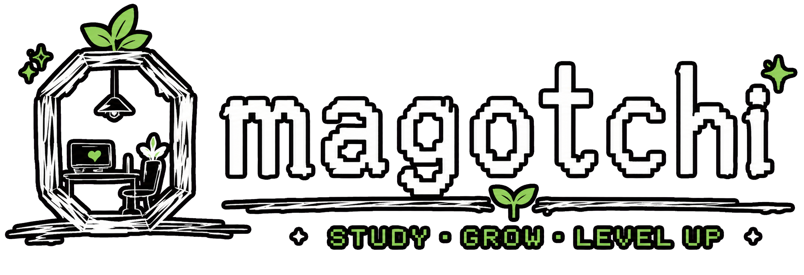

<h1>
  
  Omagotchi
</h1>

<strong>KDT 연수생과 관리자를 위한 학습 환경 관리 플랫폼</strong>

 
 

## 팀원 소개

<table>
  <tr>
    <td align="center" width="25%">
      <a href="https://github.com/Quasimorphism">
        
         
        <strong>Quasimorphism</strong>
      </a>
       
      인프라
       
      인증 · 인가
    </td>
    <td align="center" width="25%">
      <a href="https://github.com/erase1657">
        
         
        <strong>erase1657</strong>
      </a>
       
      Rule Engine
       
      &nbsp;
    </td>
    <td align="center" width="25%">
      <a href="https://github.com/jjh1228">
        
         
        <strong>jjh1228</strong>
      </a>
       
      실습실 · 팀
       
      회의실 관리
    </td>
    <td align="center" width="25%">
      <a href="https://github.com/kitturamiboiler">
        
         
        <strong>kitturamiboiler</strong>
      </a>
       
      Frontend · Gamification
       
      사용자 · 교육 기수
    </td>
  </tr>
  <tr>
    <td align="center" width="25%">
      <a href="https://github.com/woalshue">
        
         
        <strong>woalshue</strong>
      </a>
       
      Rule Engine
       
      AI
    </td>
    <td align="center" width="25%">
      <a href="https://github.com/sy-103">
        
         
        <strong>sy-103</strong>
      </a>
       
      Rule Engine
       
      AI
    </td>
    <td align="center" width="25%">
      <a href="https://github.com/yjKang02">
        
         
        <strong>yjKang02</strong>
      </a>
       
      타이머
       
      &nbsp;
    </td>
    <td align="center" width="25%">
      <a href="https://github.com/chachabc">
        
         
        <strong>chachabc</strong>
      </a>
       
      실습실 · 팀
       
      회의실 관리
    </td>
  </tr>
</table>

## 목차

- [프로젝트 소개](#프로젝트-소개)
- [KDT(K-디지털 트레이닝) 제도 개요](#kdtk-디지털-트레이닝-제도-개요)
- [배경 – 사용자가 겪던 문제](#배경--사용자가-겪던-문제)
- [문제 정의](#문제-정의)
- [해결하려는 문제](#해결하려는-문제)
- [프로젝트 목적](#프로젝트-목적)
- [해결 방안](#해결-방안)
- [주요 사용자](#주요-사용자)
- [핵심 기능](#핵심-기능)
- [프로젝트의 차별점](#프로젝트의-차별점)
- [AI 활용 방향](#ai-활용-방향)
- [서비스 구성 방향](#서비스-구성-방향)
- [기대 효과](#기대-효과)

---

## 프로젝트 소개

**Omagotchi**는 KDT(Korea Digital Training) 연수생과 관리자를 대상으로 한 **학습 환경 관리 플랫폼**입니다.

사용자(연수생)의 출결, 공부 시간, 팀 활동과 학습 공간의 환경 데이터를 통합 관리하며, 관리자는 사용자·공간·센서 상태를 한 번에 파악할 수 있습니다. 여기에 캐릭터, 퀘스트 등의 게이미피케이션 요소를 더해 지속적인 학습 참여를 유도합니다.

- **대상**: KDT
- **사용자**: 관리자, 연수생

---

## KDT(K-디지털 트레이닝) 제도 개요

Omagotchi는 KDT 연수생과 관리자를 대상으로 하기 때문에, 서비스 기획의 전제가 되는 KDT 제도를 간단히 조사했습니다.

### 어떤 제도인가

KDT는 AI, 클라우드, 반도체, 로봇 등 첨단산업·디지털 분야로의 취업·창업을 지원하는 고용노동부 주관 직업훈련사업입니다. 국민내일배움카드를 기반으로 운영되며, 훈련비의 상당 부분(카드 한도를 초과하는 금액까지)을 국비로 지원해 실무 중심 훈련을 제공합니다.

### 어떻게 운영되는가

- **훈련기관**: 정부가 선정한 훈련기관이 위탁 운영하며, 일부 과정은 고용노동부·대한상의·삼성·KT 등 선도기업이 협력하는 민관 협력 형태로도 운영됩니다.
- **출결 관리가 엄격함**: 출석률이 80% 미만이면 훈련장려금·특별훈련수당 지급이 중단되고, 훈련을 중도 이탈하면 이후 KDT 재참여 자체가 불가능합니다. 교육 종료 후 30일 이내 수강 평가를 완료해야 마지막 달 수당이 지급됩니다.

### Omagotchi 기획과의 연결점

KDT는 출석률과 이탈 여부가 훈련생의 실제 금전적 지원(장려금·수당) 및 향후 재참여 자격에 직결되는 제도입니다. 이는 배경 조사에서 나온 "출석을 자주 까먹습니다" 같은 의견이 단순한 불편이 아니라 실제 제도적 리스크와 맞닿아 있음을 보여주며, 신뢰성 있는 출결·재실 관리 기능의 필요성을 뒷받침합니다.

---

## 배경 – 사용자가 겪던 문제

기획 과정에서 수집한 실제 사용자(연수생) 의견입니다.

- 내가 공부한 시간으로 남들이랑 긍정적 경쟁을 할 수 있으면 좋겠어요
- 다른 연수생이 뭐 하고 있는지 대충이라도 알 수 있으면 좋겠어요
- 관리자가 연수생들이 제대로 학습하고 있는지 알기가 어려움
- 실습실에 주기적인 환기를 했으면 좋겠음
- 실습실 청소(먼지)가 제대로 안 됨
- 출석을 깜빡할 때 화가 남 (금전적 손해)
- 탈주(무단 이탈)하는 사람들이 출결관리에서 제대로 판정되지 않음
- 회의실을 사용할 때 눈치를 봐야 함
- 실습실 환경을 한눈에 볼 수 있으면 좋겠음
- 공부하다 보면 너무 졸림
- 에어컨이 너무 추움
- 연수생끼리 친해지기 어렵고, 친한 사람들끼리만 어울림 (프로젝트 진행 상황 공유 부재)
- 재미있게 공부하고 싶음
- 무언가 하긴 했지만 퇴실할 때 돌아보면 성취감이 없음

---

## 문제 정의

위 의견들은 다음과 같은 문제 유형으로 정리됩니다.

- **환경 문제**: 환기, 먼지, 온도, CO2 등 실습실 환경 관리 미흡
- **커뮤니케이션 부재**: 연수생 간 교류 및 활동 공유 부족
- **입·퇴실 및 출석 망각**: 출결 체크 누락, 탈주자 관리 어려움
- **학생 관리의 어려움**: 관리자가 연수생 학습 현황을 파악하기 어려움
- **학습 동기·성취 부족**: 경쟁 유도 및 성취감을 느낄 수단 부재

---

## 해결하려는 문제

- 출결, 공부 시간, 공간 이용 기록이 서로 분리되어 관리됩니다.
- 사용자가 자신의 학습 패턴을 일관되게 확인하기 어렵습니다.
- 관리자가 사용자, 공간 및 센서 상태를 한 번에 파악하기 어렵습니다.
- 단순한 기록만으로는 사용자의 지속적인 학습 참여를 유도하기 어렵습니다.

---

## 프로젝트 목적

- 출결과 공부 시간을 신뢰성 있게 기록합니다.
- 사용자가 자신의 학습 현황과 통계를 확인할 수 있도록 합니다.
- 실습실, 회의실, 스터디룸 등의 공간과 팀 활동을 관리합니다.
- 공간별 환경 데이터를 수집하고 Rule Engine을 통해 처리합니다.
- 관리자가 사용자, 출결, 학습 기록, 공간 및 센서 상태를 확인할 수 있도록 합니다.
- 랭킹, 캐릭터, 퀘스트 등의 기능으로 학습 동기를 제공합니다.

---

## 해결 방안

- 환기, 먼지, 온도, CO2 센서를 창문 모터 등 각종 기기와 연동하여 학습 환경을 자동으로 관리합니다.
- 게이미피케이션 및 소통 창구를 도입하여 연수생 간 가벼운 소통을 돕습니다.
- 정해진 출·퇴실 시간에 체크하지 않으면 마감 몇 분 전 알람을 발송합니다.
- 공부 시간, 출석률, 지각률을 기반으로 연수생의 학습 현황을 관리합니다 (레벨, 퀘스트 연계).
- 랭킹 대시보드, 퀘스트 연속 성공(스트릭), 레벨, 배지, 캐릭터(다마고치) 칭찬·진화를 통한 자기 만족과 개인화 퀘스트를 제공합니다.

---

## 주요 사용자

| 사용자 | 주요 기능 |
| --- | --- |
| 일반 사용자(연수생) | 출결, 타이머, 공부 기록, 공간·팀 기능, 랭킹 및 캐릭터 기능 사용 |
| 관리자 | 사용자, 출결, 공간, 학습 기록 및 센서 현황 관리 |

---

## 핵심 기능

| 영역 | 주요 기능 |
| --- | --- |
| 회원 및 인증 | 회원가입, 로그인, 계정 상태 관리, 사용자·관리자 권한 분리 |
| 출결 및 사용자 상태 | 입실·퇴실, 출석 상태, 재실 여부 및 현재 위치 관리 |
| 타이머 및 공부 기록 | 타이머 시작·종료, 직접 기록, 일간·주간·월간 통계 |
| 공간 관리 | 실습실·회의실·스터디룸 조회 및 사용 상태 관리 |
| 회의실 관리 | 선착순 점유, 타임아웃, 연장, 반납 및 공실 알림 |
| 팀 관리 | 팀 생성, 팀원 관리, 마스터 위임, 팀 해체 및 팀 내 랭킹 |
| 센서 데이터 | 공간별 온도·습도·CO2 수집 및 조회 |
| Rule Engine | 센서 데이터 정규화, 조건 평가 및 처리 결과 전달 |
| 랭킹 | 사용자와 팀의 공부 시간·출석률 기반 순위 제공 |
| 게이미피케이션 | 캐릭터, 경험치, 퀘스트, 스트릭, 뱃지 및 보상 |
| 관리자 대시보드 | 사용자·출결·공부 시간·공간·센서 및 운영 현황 조회 |

---

## 프로젝트의 차별점

### 학습 활동과 공간 환경의 연결

단순히 공부 시간만 기록하는 서비스가 아니라 사용자의 출결, 현재 위치, 공간 이용과 센서 데이터를 함께 관리합니다.

### Rule Engine 기반 환경 데이터 처리

센서 데이터를 단순 저장하는 데서 끝나지 않고, 설정된 조건에 따라 데이터를 평가하고 필요한 처리를 수행할 수 있도록 구성합니다.

### 학습 동기부여

공부 시간과 출석 기록을 랭킹, 캐릭터 성장, 퀘스트 등의 기능과 연결하여 지속적인 참여를 유도합니다.

### 관리자 관점의 통합 운영

관리자는 사용자와 공간의 현재 상태, 공부 시간, 출결 및 환경 데이터를 하나의 서비스에서 확인할 수 있습니다.

---

## AI 활용 방향

- 사용자의 과거 학습 기록을 기반으로 다음 학습 시간을 예측합니다.
- 예측 결과를 활용하여 개인별 퀘스트와 목표를 제안합니다.

---

## 서비스 구성 방향

Omagotchi는 모든 기능을 개별 서비스로 세분화하지 않고, 책임과 실행 특성이 명확하게 다른 영역을 중심으로 최소한의 MSA 구조를 구성합니다.

| 서비스 | 책임 |
| --- | --- |
| `frontend` | 사용자 및 관리자 화면 제공 |
| `gateway-service` | 외부 API 진입점과 서비스 라우팅 |
| `discovery-service` | 서비스 등록 및 조회 |
| `identity-service` | 회원, 인증, 계정 상태 및 권한 관리 |
| `learning-service` | 출결, 타이머, 공부 기록, 공간, 팀, 랭킹 및 게이미피케이션 |
| `rule-service` | 센서 데이터 수신, 정규화, 룰 평가 및 결과 전달 |

추가 서비스 분리는 독립적인 배포, 확장, 장애 격리 또는 데이터 소유권 분리가 필요해지는 경우에만 검토합니다.

---

## 기대 효과

- 사용자는 자신의 공부 시간과 학습 패턴을 구체적으로 확인할 수 있습니다.
- 학습 활동과 공간의 환경 정보를 함께 관리할 수 있습니다.
- 관리자는 사용자와 학습 공간의 상태를 효율적으로 파악할 수 있습니다.
- 환경 데이터를 활용한 규칙 기반 자동화가 가능합니다.
- 게이미피케이션을 통해 사용자의 지속적인 학습 참여를 유도할 수 있습니다.
- 축적된 데이터를 기반으로 향후 개인화 학습 지원 기능으로 확장할 수 있습니다.
