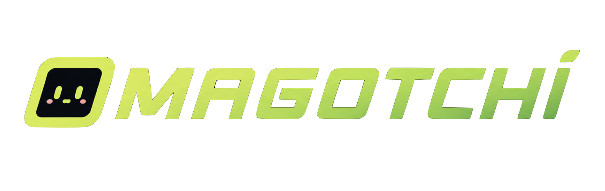
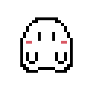
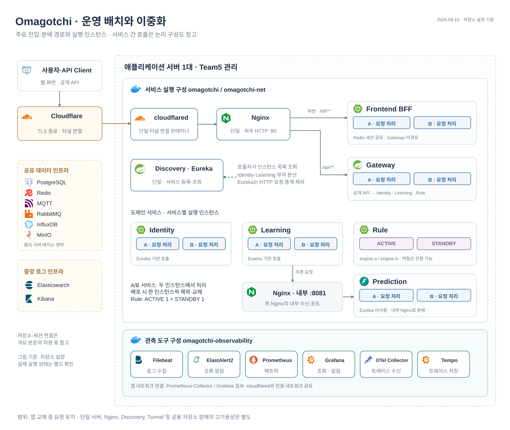
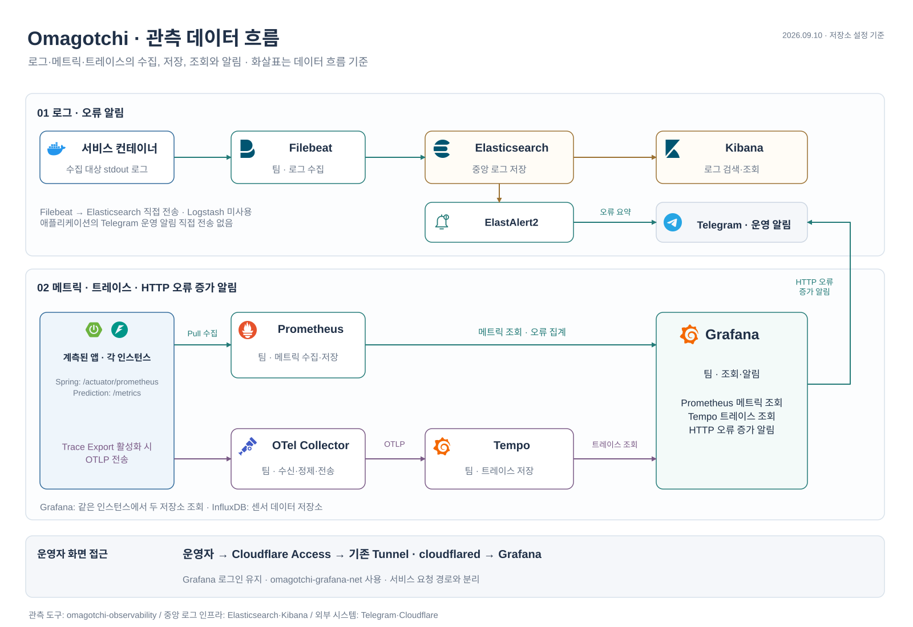

  

<strong>Omagotchi - KDT 연수생과 관리자를 위한 학습 환경 관리 플랫폼</strong>

출결, 학습 시간, 공간 이용, 환경 센서 데이터를 하나로 연결해 학습 몰입과 운영 관리를 돕는 서비스입니다.

---

## 목차

- [Omagotchi가 해결하려는 것](#omagotchi가-해결하려는-것)
- [서비스 목표](#서비스-목표)
- [팀원 소개](#팀원-소개)
- [기술 스택](#기술-스택)
- [레포지토리 구성](#레포지토리-구성)
- [아키텍처](#아키텍처)
- [주요 기능](#주요-기능)
- [저작권 및 캐릭터 IP](#저작권-및-캐릭터-ip)

---

## Omagotchi가 해결하려는 것

KDT 교육 과정에서는 출결, 학습 지속성, 공간 이용 현황, 학습 환경이 모두 중요하지만 실제 운영에서는 각각의 정보가 분리되어 관리됩니다. Omagotchi는 흩어진 학습 활동과 공간 데이터를 하나로 모아 연수생에게는 꾸준히 학습할 이유를, 관리자에게는 운영 상태를 빠르게 파악할 수 있는 기준을 제공합니다.

캐릭터 성장, 퀘스트, 랭킹 같은 게이미피케이션 요소를 통해 학습 기록을 단순한 숫자가 아니라 매일 확인하고 싶은 피드백으로 바꾸는 것이 핵심입니다.

## 문제 배경

- 출석이나 퇴실 체크를 깜빡해 실제 학습과 다른 기록이 남습니다.
- 관리자가 연수생의 재실 여부와 학습 상태를 한눈에 파악하기 어렵습니다.
- 회의실, 스터디룸, 실습실 사용 현황이 명확하지 않아 눈치를 보게 됩니다.
- 공부 시간은 쌓이지만 성취감이나 지속적인 동기부여로 이어지지 않습니다.
- 실습실의 온도, 습도, CO2 같은 환경 정보가 학습 경험과 분리되어 있습니다.
- 연수생 간 학습 현황과 팀 활동이 잘 공유되지 않아 교류가 줄어듭니다.

## 문제 정의

위 문제는 다음과 같은 운영·학습 경험의 결핍으로 정리됩니다.

- **환경 문제**: 환기, 먼지, 온도, CO2 등 실습실 환경 관리 미흡
- **커뮤니케이션 부재**: 연수생 간 교류 및 활동 공유 부족
- **입·퇴실 및 출석 망각**: 출결 체크 누락, 무단 이탈 관리 어려움
- **학생 관리의 어려움**: 관리자가 연수생 학습 현황을 파악하기 어려움
- **학습 동기·성취 부족**: 경쟁 유도 및 성취감을 느낄 수단 부재

## 서비스 목표

Omagotchi는 KDT 연수생의 출결과 학습 시간을 신뢰성 있게 기록하고, 공간 이용 및 환경 데이터를 함께 관리하는 학습 운영 플랫폼입니다.

관리자는 사용자, 출결, 학습 기록, 공간, 센서 상태를 통합 대시보드에서 확인할 수 있고, 연수생은 자신의 학습 패턴과 성장 상태를 캐릭터, 퀘스트, 랭킹을 통해 직관적으로 확인할 수 있습니다.

## 해결 방안

- MQTT로 온도, 습도, CO2 센서 데이터를 수집하고 Rule Engine을 통해 조건 기반으로 평가·전달합니다.
- 게이미피케이션 및 소통 기능을 도입해 연수생 간 가벼운 참여와 교류를 유도합니다.
- 정해진 출·퇴실 시간에 체크하지 않으면 텔레그램 봇으로 마감 전 알림을 발송합니다.
- 공부 시간, 출석률, 지각률을 기반으로 연수생의 학습 현황을 관리합니다.
- 랭킹 대시보드, 퀘스트 스트릭, 레벨, 배지, 캐릭터 성장 기능을 통해 학습 성취감을 제공합니다.
- AI 챗봇이 학습 기록·공간 환경·날씨를 직접 조회해 대화형으로 학습을 지원합니다.
- 사용자의 학습 기록을 기반으로 내일 예상 공부 시간을 예측해 개인별 일일 퀘스트 목표에 반영합니다.

## 주요 사용자

| 사용자 | 주요 기능 |
| --- | --- |
| 일반 사용자(연수생) | 출결, 타이머, 공부 기록, 공간·팀 기능, 랭킹 및 캐릭터 기능 사용 |
| 관리자 | 사용자, 출결, 공간, 학습 기록 및 센서 현황 관리 |

## 핵심 가치

| 가치 | 설명 |
| --- | --- |
| 🧭 통합 관리 | 출결, 학습 시간, 팀, 공간, 센서 데이터를 하나의 흐름으로 연결 |
| 🎮 지속 동기부여 | 캐릭터 성장, 퀘스트, 스트릭, 랭킹으로 학습 참여를 유도 |
| 🏫 공간 운영 효율화 | 실습실, 회의실, 스터디룸의 사용 상태와 환경 데이터를 함께 관리 |
| ⚙️ 규칙 기반 자동화 | 센서 데이터와 Rule Engine을 기반으로 조건 평가 및 후속 처리 수행 |
| 📊 운영 가시성 | 관리자 대시보드에서 사용자·공간·학습·환경 상태를 한눈에 확인 |
| 🤖 AI 확장성 | 학습 기록 기반 예측과 개인화 퀘스트 추천으로 확장 가능 |

## 프로젝트 정보

| 항목 | 내용 |
| --- | --- |
| 프로젝트명 | Omagotchi |
| 대상 | KDT 연수생 및 관리자 |
| 목적 | 학습 기록, 출결, 공간, 환경 데이터를 통합 관리하고 학습 지속성을 높이는 플랫폼 구축 |
| 주요 도메인 | 출결, 학습 타이머, 공간 관리, 팀 관리, 게이미피케이션, 센서 데이터, Rule Engine |

## 팀원 소개

<table>
  <tr>
    <td align="center" width="25%">
      <a href="https://github.com/Quasimorphism">
        
         
        <strong>Quasimorphism</strong>
      </a>
       
      Infra
       
      Identity
    </td>
    <td align="center" width="25%">
      <a href="https://github.com/erase1657">
        
         
        <strong>erase1657</strong>
      </a>
       
      Rule Engine
       
      Community
    </td>
    <td align="center" width="25%">
      <a href="https://github.com/jjh1228">
        
         
        <strong>jjh1228</strong>
      </a>
       
      Space
       
      Team
    </td>
    <td align="center" width="25%">
      <a href="https://github.com/kitturamiboiler">
        
         
        <strong>kitturamiboiler</strong>
      </a>
       
      Gamification
       
      User · Cohort
    </td>
  </tr>
  <tr>
    <td align="center" width="25%">
      <a href="https://github.com/woalshue">
        
         
        <strong>woalshue</strong>
      </a>
       
      Rule Engine
       
      AI/LLM
    </td>
    <td align="center" width="25%">
      <a href="https://github.com/sy-103">
        
         
        <strong>sy-103</strong>
      </a>
       
      Rule Engine
       
      AI/LLM
    </td>
    <td align="center" width="25%">
      <a href="https://github.com/yjKang02">
        
         
        <strong>yjKang02</strong>
      </a>
       
      Timer
       
      Ranking
    </td>
    <td align="center" width="25%">
      <a href="https://github.com/chachabc">
        
         
        <strong>chachabc</strong>
      </a>
       
      Space
       
      Meeting Room
    </td>
  </tr>
</table>

> 팀원 프로필 및 서비스 내 캐릭터는 한국저작권위원회에 등록된 미술저작물 **「시로몽」**(등록번호 `C-2026-040776`)이며, 저작권은 저작자 개인에게 귀속됩니다. 자세한 내용은 [저작권 및 캐릭터 IP](#저작권-및-캐릭터-ip)를 참고해 주세요.

## 기술 스택

### Backend & Frameworks

### Database & Message Broker

-FF6600?style=for-the-badge&logo=rabbitmq&logoColor=white)
-660066?style=for-the-badge&logo=mqtt&logoColor=white)

### Infrastructure & Tools

-4B8BBE?style=for-the-badge)

### Frontend

-F7DF1E?style=for-the-badge&logo=javascript&logoColor=black)

### AI

<strong>AI 챗봇</strong> — Spring AI 2.0.1 기반, 모델 전환 · Tool Calling 6종

 

**모델** — 요청 파라미터로 전환합니다.

| 구분 | 모델 | 온도 | 비고 |
| --- | --- | --- | --- |
| GEMINI (기본) | `gemini-3.6-flash` | 0.7 | API Key 라운드로빈, `thinking-level: MINIMAL` |
| OLLAMA | `qwen2.5:latest` | 0.3 | 자체 호스팅 폴백 |

> 모델명은 `application.yaml` 설정 기준이며 운영 중 변경될 수 있습니다.

**Tool Calling** — 챗봇이 직접 조회하는 도구 6종

`공부 시간 요약` `개인 학습 패턴` `상위 학습자 패턴` `공간 환경(온·습도·CO2)` `종합 학습 리포트` `기상청 날씨`

**구현 상세**

- 대화기록: Redis 저장, 최근 10메시지 윈도우, 1시간 미사용 시 자동 삭제
- 응답 방식: SSE 스트리밍 (`Flux<String>`, `text/event-stream`)
- 대화방 분리: JWT `userId` 기준 `conversationId`
- 장애 대응: Gemini API Key 라운드로빈, Tool 실행 실패 시 대화 유지

### Test & Quality

### 기타 연동

<strong>서비스별 사용 현황</strong>

 

| 구분 | gateway | frontend (BFF) | identity | learning | rule | ai |
| --- | --- | --- | --- | --- | --- | --- |
| 웹 계층 | WebFlux | MVC + Thymeleaf | REST | REST + WebSocket | 메시지 기반 | FastAPI |
| RDB | - | - | PostgreSQL | PostgreSQL | - | - |
| 시계열 DB | - | - | - | - | InfluxDB | - |
| 캐시 / 세션 | - | Redis | - | Redis, Caffeine | - | - |
| 스토리지 | - | - | - | MinIO | - | - |
| 메시징 | - | - | - | RabbitMQ | MQTT → RabbitMQ | - |
| 인증 | OAuth2 Resource Server | Spring Security | JWT 발급 | - | - | - |
| 디스커버리 | Eureka | Eureka | Eureka | Eureka | Eureka | - |

## 레포지토리 구성

### Docs

| Repository | 설명 |
| --- | --- |
| [`docs`](https://github.com/nhnacademy-aiot3-omagotchi/docs) | 아키텍처 문서·ADR·컨벤션 등 기타 문서를 모아두는 곳 |

### Gateway & Infra

| Repository | 설명 |
| --- | --- |
| [`omagotchi-infra`](https://github.com/nhnacademy-aiot3-omagotchi/omagotchi-infra) | Docker Compose·Nginx·Cloudflare Tunnel 기반 운영 컨테이너 구성, 런타임 설정(`.env`) 동기화 및 배포 자동화 |
| [`omagotchi-gateway-service`](https://github.com/nhnacademy-aiot3-omagotchi/omagotchi-gateway-service) | 외부 API 단일 진입점. JWT 검증·권한 판별 후 내부 서비스로 라우팅 (Spring Cloud Gateway) |
| [`omagotchi-discovery-service`](https://github.com/nhnacademy-aiot3-omagotchi/omagotchi-discovery-service) | Eureka 서비스 레지스트리. 인스턴스 등록 및 조회, 로드밸런싱 기반 제공 |

### Frontend

| Repository | 설명 |
| --- | --- |
| [`omagotchi-frontend`](https://github.com/nhnacademy-aiot3-omagotchi/omagotchi-frontend) | 사용자·관리자 화면. Thymeleaf 서버 렌더링 + React/Vite 위젯, Phaser 기반 캐릭터 화면, Redis 세션 관리 |

### Core Services

| Repository | 설명 |
| --- | --- |
| [`omagotchi-identity-service`](https://github.com/nhnacademy-aiot3-omagotchi/omagotchi-identity-service) | 회원 가입·로그인, JWT 발급/재발급, 권한(Role)·계정 상태 관리, 이메일 인증 |
| [`omagotchi-learning-service`](https://github.com/nhnacademy-aiot3-omagotchi/omagotchi-learning-service) | 서비스 핵심 도메인. 출결·타이머·공부 기록, 공간/좌석·팀·커뮤니티·채팅, 랭킹·통계·게이미피케이션(퀘스트), 실시간 접속, 임계값 룰 관리, 텔레그램 알림 |

### IoT & AI

| Repository | 설명 |
| --- | --- |
| [`omagotchi-rule-service`](https://github.com/nhnacademy-aiot3-omagotchi/omagotchi-rule-service) | MQTT 센서 이벤트 수집 → 정규화·품질 검사 → 룰(임계값) 평가 → RabbitMQ 발행 → InfluxDB 시계열 적재. A/B 핫스탠바이 운영 |
| [`omagotchi-rule-simulator`](https://github.com/nhnacademy-aiot3-omagotchi/omagotchi-rule-simulator) | 실제 센서 없이 ChirpStack 프레임·장애 시나리오를 MQTT로 발행하는 테스트용 가상 센서 |
| [`omagotchi-prediction-service`](https://github.com/nhnacademy-aiot3-omagotchi/omagotchi-prediction-service) | FastAPI + LightGBM 추론 전용. learning-service가 보낸 피처 32개로 내일 예상 공부 시간(0~11.5h) 예측 |
| [`esp32-actuator-simulator`](https://github.com/nhnacademy-aiot3-omagotchi/esp32-actuator-simulator) | ESP32 액추에이터 동작을 모사하는 하드웨어 시뮬레이터 |

## 아키텍처

### 논리 서비스 구성

  

운영 배치와 이중화

  

- 서비스별 A/B 인스턴스와 Rule ACTIVE/STANDBY 구성
- 애플리케이션 서버와 공유 데이터·중앙 로그 인프라의 연결

관측 데이터 흐름

  

- 로그·메트릭·트레이스의 수집·저장·조회 경로
- Telegram 운영 알림과 Cloudflare Access 기반 Grafana 접속

- 상세 설명·draw.io 원본: [시스템 개요](https://github.com/nhnacademy-aiot3-omagotchi/docs/blob/main/20-architecture/01-system-overview.md)

## 서비스 구성 방향

Omagotchi는 모든 기능을 개별 서비스로 세분화하지 않고, 책임과 실행 특성이 명확하게 다른 영역을 중심으로 최소한의 MSA 구조를 구성합니다.

| 서비스 | 책임 |
| --- | --- |
| `frontend` | 사용자 및 관리자 화면 제공 |
| `gateway-service` | 외부 API 진입점과 서비스 라우팅 |
| `discovery-service` | 서비스 등록 및 조회 |
| `identity-service` | 회원, 인증, 계정 상태 및 권한 관리 |
| `learning-service` | 출결, 타이머, 공부 기록, 공간, 팀, 랭킹, 게이미피케이션 및 AI 챗봇 |
| `rule-service` | 센서 데이터 수신, 정규화, 룰 평가 및 결과 전달 |
| `prediction-service` | 학습 데이터 기반 공부 시간 예측 추론 |

서비스 분리 기준은 **실행 특성**입니다. `rule-service`는 MQTT 상시 구독·고빈도 이벤트 처리, `prediction-service`는 Python ML 런타임으로 실행 환경 자체가 달라 분리했습니다. 그 외 추가 분리는 독립적인 배포, 확장, 장애 격리 또는 데이터 소유권 분리가 필요해지는 경우에만 검토합니다.

## 주요 기능

| 영역 | 주요 기능 |
| --- | --- |
| 회원 및 인증 | 회원가입, 이메일 인증, 로그인, 계정 상태 관리, 사용자·관리자 권한 분리 |
| 출결 및 사용자 상태 | 입실·퇴실, 출석 상태, 재실 여부 및 현재 위치 관리 |
| 타이머 및 공부 기록 | 타이머 시작·종료, 직접 기록, 일간·주간·월간 통계 |
| 공간 관리 | 실습실·회의실·스터디룸 조회 및 사용 상태 관리 |
| 회의실 관리 | 선착순 점유, 타임아웃, 연장, 반납 및 공실 알림 |
| 팀 관리 | 팀 생성, 팀원 관리, 마스터 위임, 팀 해체 및 팀 내 랭킹 |
| 커뮤니티 | 게시글 작성·조회, 비속어 필터링 |
| 센서 데이터 | 공간별 온도·습도·CO2 수집, 시계열 저장 및 조회 |
| Rule Engine | 센서 데이터 정규화, 품질 검사, 임계값 조건 평가 및 결과 전달 |
| 랭킹 | 사용자와 팀의 공부 시간·출석률 기반 순위 제공 |
| 게이미피케이션 | 캐릭터 성장, 경험치, 일일 퀘스트, 스트릭, 배지 및 보상 |
| AI 챗봇 | 대화형 학습 도우미, 공부 기록·날씨·공간 현황 조회 도구 연동 |
| 학습량 예측 | 학습 이력 기반 내일 예상 공부 시간 예측 및 퀘스트 목표 반영 |
| 알림 | 텔레그램 봇 연동, 공실·이상 환경 알림 |
| 실시간 | WebSocket 기반 접속 상태 및 재실 현황 동기화 |
| 관리자 대시보드 | 사용자·출결·공부 시간·공간·센서 및 운영 현황 조회 |

## 프로젝트의 차별점

### 학습 활동과 공간 환경의 연결

단순히 공부 시간만 기록하는 서비스가 아니라 사용자의 출결, 현재 위치, 공간 이용과 센서 데이터를 함께 관리합니다.

### Rule Engine 기반 환경 데이터 처리

센서 데이터를 단순 저장하는 데서 끝내지 않고, MQTT로 수집한 데이터를 정규화·품질 검사한 뒤 설정된 조건에 따라 평가하고 결과를 전달합니다. 룰 변경은 메시지 기반으로 즉시 반영되며, 5분 주기 재동기화로 누락을 보정합니다.

### 학습 데이터 기반 예측과 목표 추천

과거 학습 기록에서 추출한 피처 32개를 LightGBM 모델로 추론해 내일 예상 공부 시간을 산출하고, 그 값을 개인별 일일 퀘스트 목표에 반영합니다. 예측 실패 시 최근 등원 평균 기반 규칙으로, 그마저 불가하면 기본값으로 단계적으로 내려가 퀘스트 발급 자체는 중단되지 않습니다.

### 학습 동기부여

공부 시간과 출석 기록을 랭킹, 캐릭터 성장, 퀘스트, 스트릭과 연결해 지속적인 참여를 유도합니다.

### 대화형 학습 도우미

챗봇이 프롬프트 응답에 그치지 않고 학습 기록, 공간 환경, 날씨 등을 직접 조회하는 도구 6종을 호출해 답변합니다.

### 관리자 관점의 통합 운영

관리자는 사용자와 공간의 현재 상태, 공부 시간, 출결 및 환경 데이터를 하나의 서비스에서 확인할 수 있습니다.

## KDT 배경

KDT(K-디지털 트레이닝)는 디지털 분야 취업을 위한 실무 중심 직업훈련 과정입니다. 출석률과 학습 지속성은 수료, 훈련장려금, 과정 참여 경험과 직접 연결되기 때문에 단순한 편의 기능이 아니라 신뢰성 있는 운영 관리의 핵심 요소입니다.

Omagotchi는 이러한 제도적 특성을 바탕으로 출결 누락, 학습 이탈, 공간 운영 불편, 학습 동기 저하 문제를 함께 해결하는 것을 목표로 합니다.

## 기대 효과

- 연수생은 자신의 공부 시간과 학습 패턴을 구체적으로 확인할 수 있습니다.
- 출결, 공간 이용, 팀 활동, 환경 정보를 하나의 서비스에서 관리할 수 있습니다.
- 관리자는 사용자와 학습 공간의 현재 상태를 효율적으로 파악할 수 있습니다.
- Rule Engine을 통해 환경 데이터를 조건 기반으로 처리하고 자동화할 수 있습니다.
- 게이미피케이션을 통해 사용자의 지속적인 학습 참여를 유도할 수 있습니다.
- 축적된 데이터를 기반으로 개인화 학습 지원 기능으로 확장할 수 있습니다.

## 저작권 및 캐릭터 IP

Omagotchi에 등장하는 마스코트 및 캐릭터 일체는 **한국저작권위원회에 등록된 미술저작물 「시로몽」**입니다.

본 캐릭터는 **저작자 개인이 단독으로 창작한 저작물**이며, 프로젝트에는 저작자의 이용 허락에 따라 사용되고 있습니다. 공동 창작물이나 업무상저작물이 아니므로 **저작권은 팀·소속 기관이 아닌 저작자 개인에게 귀속**되며, 이는 등록공보상 저작자·등록권리자 표기로 확인됩니다.

| 항목 | 내용 |
| --- | --- |
| 등록번호 | 제 **C-2026-040776** 호 |
| 저작물 제호 | 시로몽 |
| 저작물 종류 | 미술저작물 |
| 등록부문 | 일반저작물 저작권 등록 (저작자성명, 창작연월일, 맨처음공표연월일) |
| 저작자 | 문재민 (단독 저작) |
| 등록권리자 | 문재민 |
| 창작연월일 | 2026년 07월 14일 |
| 맨처음공표연월일 | 2026년 07월 15일 |
| 등록연월일 | 2026년 08월 21일 |
| 등록기관 | 한국저작권위원회 |

> 「저작권법」 제53조에 따라 등록된 저작물입니다.
> 등록 사실은 한국저작권위원회 [저작권등록시스템(CROS) 등록공보 조회](https://www.cros.or.kr/psnsys/cmmn/infoPage.do?w2xPath=%2Fui%2Ftwc%2Fsch%2FregInfSerc%2FregInfSercList.xml)에서 등록번호 `C-2026-040776` 로 직접 확인하실 수 있습니다.

- 본 저작물은 **Omagotchi 프로젝트 내 사용에 한해** 이용이 허락된 것이며, 프로젝트 참여를 이유로 권리가 이전되지 않습니다.
- 캐릭터 이미지의 **무단 복제, 배포, 전송, 상업적 이용 및 2차적 저작물 작성을 금지**합니다.
- 프로젝트 소스 코드의 라이선스와 캐릭터 저작물의 권리는 **별개로 적용**됩니다.
- 이용 문의는 저작자에게 별도로 연락해 주시기 바랍니다.
- 위 표는 저작권 등록증 기재사항 중 **권리 확인에 필요한 항목만 발췌**한 것입니다. 저작자의 **주소 및 생년월일 등 개인정보는 비공개 처리**했으며, 등록증 원본은 첨부하지 않습니다.
