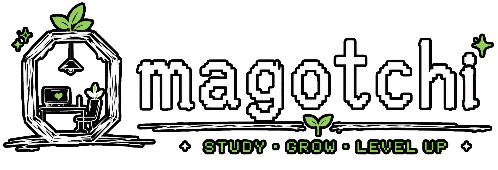
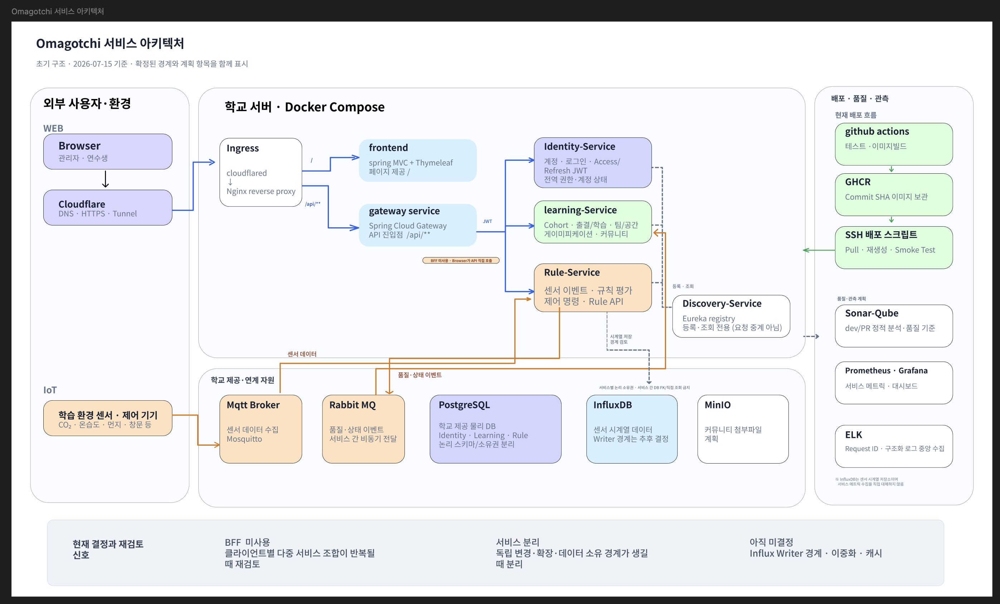

  

<strong>Omagotchi - KDT 연수생과 관리자를 위한 학습 환경 관리 플랫폼</strong>

출결, 학습 시간, 공간 이용, 환경 센서 데이터를 하나로 연결해 학습 몰입과 운영 관리를 돕는 서비스입니다.

---

## 목차

- [Omagotchi가 해결하려는 것](#omagotchi가-해결하려는-것)
- [서비스 목표](#서비스-목표)
- [팀원 소개](#팀원-소개)
- [기술 스택](#기술-스택)
- [레포지토리 구성](#레포지토리-구성)
- [아키텍처](#아키텍처)
- [주요 기능](#주요-기능)

---

## Omagotchi가 해결하려는 것

KDT 교육 과정에서는 출결, 학습 지속성, 공간 이용 현황, 학습 환경이 모두 중요하지만 실제 운영에서는 각각의 정보가 분리되어 관리됩니다. Omagotchi는 흩어진 학습 활동과 공간 데이터를 하나로 모아 연수생에게는 꾸준히 학습할 이유를, 관리자에게는 운영 상태를 빠르게 파악할 수 있는 기준을 제공합니다.

캐릭터 성장, 퀘스트, 랭킹 같은 게이미피케이션 요소를 통해 학습 기록을 단순한 숫자가 아니라 매일 확인하고 싶은 피드백으로 바꾸는 것이 핵심입니다.

## 문제 배경

- 출석이나 퇴실 체크를 깜빡해 실제 학습과 다른 기록이 남습니다.
- 관리자가 연수생의 재실 여부와 학습 상태를 한눈에 파악하기 어렵습니다.
- 회의실, 스터디룸, 실습실 사용 현황이 명확하지 않아 눈치를 보게 됩니다.
- 공부 시간은 쌓이지만 성취감이나 지속적인 동기부여로 이어지지 않습니다.
- 실습실의 온도, 습도, CO2 같은 환경 정보가 학습 경험과 분리되어 있습니다.
- 연수생 간 학습 현황과 팀 활동이 잘 공유되지 않아 교류가 줄어듭니다.

## 문제 정의

위 문제는 다음과 같은 운영·학습 경험의 결핍으로 정리됩니다.

- **환경 문제**: 환기, 먼지, 온도, CO2 등 실습실 환경 관리 미흡
- **커뮤니케이션 부재**: 연수생 간 교류 및 활동 공유 부족
- **입·퇴실 및 출석 망각**: 출결 체크 누락, 무단 이탈 관리 어려움
- **학생 관리의 어려움**: 관리자가 연수생 학습 현황을 파악하기 어려움
- **학습 동기·성취 부족**: 경쟁 유도 및 성취감을 느낄 수단 부재

## 서비스 목표

Omagotchi는 KDT 연수생의 출결과 학습 시간을 신뢰성 있게 기록하고, 공간 이용 및 환경 데이터를 함께 관리하는 학습 운영 플랫폼입니다.

관리자는 사용자, 출결, 학습 기록, 공간, 센서 상태를 통합 대시보드에서 확인할 수 있고, 연수생은 자신의 학습 패턴과 성장 상태를 캐릭터, 퀘스트, 랭킹을 통해 직관적으로 확인할 수 있습니다.

## 해결 방안

- 온도, 습도, CO2 센서 데이터를 수집하고 Rule Engine을 통해 조건 기반으로 처리합니다.
- 게이미피케이션 및 소통 기능을 도입해 연수생 간 가벼운 참여와 교류를 유도합니다.
- 정해진 출·퇴실 시간에 체크하지 않으면 마감 전 알림을 발송합니다.
- 공부 시간, 출석률, 지각률을 기반으로 연수생의 학습 현황을 관리합니다.
- 랭킹 대시보드, 퀘스트 스트릭, 레벨, 배지, 캐릭터 성장 기능을 통해 학습 성취감을 제공합니다.
- 사용자의 학습 기록을 기반으로 개인화 퀘스트와 학습 목표 추천으로 확장합니다.

## 주요 사용자

| 사용자 | 주요 기능 |
| --- | --- |
| 일반 사용자(연수생) | 출결, 타이머, 공부 기록, 공간·팀 기능, 랭킹 및 캐릭터 기능 사용 |
| 관리자 | 사용자, 출결, 공간, 학습 기록 및 센서 현황 관리 |

## 핵심 가치

| 가치 | 설명 |
| --- | --- |
| 🧭 통합 관리 | 출결, 학습 시간, 팀, 공간, 센서 데이터를 하나의 흐름으로 연결 |
| 🎮 지속 동기부여 | 캐릭터 성장, 퀘스트, 스트릭, 랭킹으로 학습 참여를 유도 |
| 🏫 공간 운영 효율화 | 실습실, 회의실, 스터디룸의 사용 상태와 환경 데이터를 함께 관리 |
| ⚙️ 규칙 기반 자동화 | 센서 데이터와 Rule Engine을 기반으로 조건 평가 및 후속 처리 수행 |
| 📊 운영 가시성 | 관리자 대시보드에서 사용자·공간·학습·환경 상태를 한눈에 확인 |
| 🤖 AI 확장성 | 학습 기록 기반 예측과 개인화 퀘스트 추천으로 확장 가능 |

## 프로젝트 정보

| 항목 | 내용 |
| --- | --- |
| 프로젝트명 | Omagotchi |
| 대상 | KDT 연수생 및 관리자 |
| 목적 | 학습 기록, 출결, 공간, 환경 데이터를 통합 관리하고 학습 지속성을 높이는 플랫폼 구축 |
| 주요 도메인 | 출결, 학습 타이머, 공간 관리, 팀 관리, 게이미피케이션, 센서 데이터, Rule Engine |

## 팀원 소개

<table>
  <tr>
    <td align="center" width="25%">
      <a href="https://github.com/Quasimorphism">
        
         
        <strong>Quasimorphism</strong>
      </a>
       
      Infra
       
      Identity
    </td>
    <td align="center" width="25%">
      <a href="https://github.com/erase1657">
        
         
        <strong>erase1657</strong>
      </a>
       
      Rule Engine
       
      Community
    </td>
    <td align="center" width="25%">
      <a href="https://github.com/jjh1228">
        
         
        <strong>jjh1228</strong>
      </a>
       
      Space
       
      Team
    </td>
    <td align="center" width="25%">
      <a href="https://github.com/kitturamiboiler">
        
         
        <strong>kitturamiboiler</strong>
      </a>
       
      Gamification
       
      User · Cohort
    </td>
  </tr>
  <tr>
    <td align="center" width="25%">
      <a href="https://github.com/woalshue">
        
         
        <strong>woalshue</strong>
      </a>
       
      Rule Engine
       
      AI
    </td>
    <td align="center" width="25%">
      <a href="https://github.com/sy-103">
        
         
        <strong>sy-103</strong>
      </a>
       
      Rule Engine
       
      AI
    </td>
    <td align="center" width="25%">
      <a href="https://github.com/yjKang02">
        
         
        <strong>yjKang02</strong>
      </a>
       
      Timer
       
      &nbsp;
    </td>
    <td align="center" width="25%">
      <a href="https://github.com/chachabc">
        
         
        <strong>chachabc</strong>
      </a>
       
      Space
       
      Meeting Room
    </td>
  </tr>
</table>

## 기술 스택

### Backend & Frameworks

### Database & Message Broker

### Infrastructure & Tools

### Frontend

### AI

## 레포지토리 구성

### Docs

| Repository | 설명 |
| --- | --- |
| [`docs`](https://github.com/nhnacademy-aiot3-omagotchi/docs) | 기타 문서를 모아두는 곳 |

### Gateway & Infra

| Repository | 설명 |
| --- | --- |
| [`omagotchi-infra`](https://github.com/nhnacademy-aiot3-omagotchi/omagotchi-infra) | 인프라 구성 및 배포 환경 관리 |
| [`omagotchi-gateway-service`](https://github.com/nhnacademy-aiot3-omagotchi/omagotchi-gateway-service) | 외부 API 진입점 및 서비스 라우팅 |
| [`omagotchi-discovery-service`](https://github.com/nhnacademy-aiot3-omagotchi/omagotchi-discovery-service) | 서비스 등록 및 조회 |

### Frontend

| Repository | 설명 |
| --- | --- |
| [`omagotchi-frontend`](https://github.com/nhnacademy-aiot3-omagotchi/omagotchi-frontend) | 사용자 및 관리자 화면 |

### Core Services

| Repository | 설명 |
| --- | --- |
| [`omagotchi-identity-service`](https://github.com/nhnacademy-aiot3-omagotchi/omagotchi-identity-service) | 회원, 인증, 인가, 계정 상태 관리 |
| [`omagotchi-learning-service`](https://github.com/nhnacademy-aiot3-omagotchi/omagotchi-learning-service) | 출결, 타이머, 공부 기록, 공간, 팀, 랭킹 및 게이미피케이션 |

### Rule & AI

| Repository | 설명 |
| --- | --- |
| [`omagotchi-rule-service`](https://github.com/nhnacademy-aiot3-omagotchi/omagotchi-rule-service) | 센서 데이터 처리, 조건 평가, Rule Engine |

## 아키텍처

  

## 서비스 구성 방향

Omagotchi는 모든 기능을 개별 서비스로 세분화하지 않고, 책임과 실행 특성이 명확하게 다른 영역을 중심으로 최소한의 MSA 구조를 구성합니다.

| 서비스 | 책임 |
| --- | --- |
| `frontend` | 사용자 및 관리자 화면 제공 |
| `gateway-service` | 외부 API 진입점과 서비스 라우팅 |
| `discovery-service` | 서비스 등록 및 조회 |
| `identity-service` | 회원, 인증, 계정 상태 및 권한 관리 |
| `learning-service` | 출결, 타이머, 공부 기록, 공간, 팀, 랭킹 및 게이미피케이션 |
| `rule-service` | 센서 데이터 수신, 정규화, 룰 평가 및 결과 전달 |

추가 서비스 분리는 독립적인 배포, 확장, 장애 격리 또는 데이터 소유권 분리가 필요해지는 경우에만 검토합니다.

## 주요 기능

| 영역 | 주요 기능 |
| --- | --- |
| 회원 및 인증 | 회원가입, 로그인, 계정 상태 관리, 사용자·관리자 권한 분리 |
| 출결 및 사용자 상태 | 입실·퇴실, 출석 상태, 재실 여부 및 현재 위치 관리 |
| 타이머 및 공부 기록 | 타이머 시작·종료, 직접 기록, 일간·주간·월간 통계 |
| 공간 관리 | 실습실·회의실·스터디룸 조회 및 사용 상태 관리 |
| 회의실 관리 | 선착순 점유, 타임아웃, 연장, 반납 및 공실 알림 |
| 팀 관리 | 팀 생성, 팀원 관리, 마스터 위임, 팀 해체 및 팀 내 랭킹 |
| 센서 데이터 | 공간별 온도·습도·CO2 수집 및 조회 |
| Rule Engine | 센서 데이터 정규화, 조건 평가 및 처리 결과 전달 |
| 랭킹 | 사용자와 팀의 공부 시간·출석률 기반 순위 제공 |
| 게이미피케이션 | 캐릭터, 경험치, 퀘스트, 스트릭, 배지 및 보상 |
| 관리자 대시보드 | 사용자·출결·공부 시간·공간·센서 및 운영 현황 조회 |

## 프로젝트의 차별점

### 학습 활동과 공간 환경의 연결

단순히 공부 시간만 기록하는 서비스가 아니라 사용자의 출결, 현재 위치, 공간 이용과 센서 데이터를 함께 관리합니다.

### Rule Engine 기반 환경 데이터 처리

센서 데이터를 단순 저장하는 데서 끝내지 않고, 설정된 조건에 따라 데이터를 평가하고 필요한 처리를 수행할 수 있도록 구성합니다.

### 학습 동기부여

공부 시간과 출석 기록을 랭킹, 캐릭터 성장, 퀘스트 등의 기능과 연결하여 지속적인 참여를 유도합니다.

### 관리자 관점의 통합 운영

관리자는 사용자와 공간의 현재 상태, 공부 시간, 출결 및 환경 데이터를 하나의 서비스에서 확인할 수 있습니다.

## AI 적용 검토 방향

- 모델은 추후 선정합니다.
- 사용자의 과거 학습 기록을 기반으로 학습 시간 예측 가능성을 검토합니다.
- 학습 패턴, 출석률, 스트릭 데이터를 결합해 개인별 퀘스트와 목표 추천 가능성을 검토합니다.

## KDT 배경

KDT(K-디지털 트레이닝)는 디지털 분야 취업을 위한 실무 중심 직업훈련 과정입니다. 출석률과 학습 지속성은 수료, 훈련장려금, 과정 참여 경험과 직접 연결되기 때문에 단순한 편의 기능이 아니라 신뢰성 있는 운영 관리의 핵심 요소입니다.

Omagotchi는 이러한 제도적 특성을 바탕으로 출결 누락, 학습 이탈, 공간 운영 불편, 학습 동기 저하 문제를 함께 해결하는 것을 목표로 합니다.

## 기대 효과

- 연수생은 자신의 공부 시간과 학습 패턴을 구체적으로 확인할 수 있습니다.
- 출결, 공간 이용, 팀 활동, 환경 정보를 하나의 서비스에서 관리할 수 있습니다.
- 관리자는 사용자와 학습 공간의 현재 상태를 효율적으로 파악할 수 있습니다.
- Rule Engine을 통해 환경 데이터를 조건 기반으로 처리하고 자동화할 수 있습니다.
- 게이미피케이션을 통해 사용자의 지속적인 학습 참여를 유도할 수 있습니다.
- 축적된 데이터를 기반으로 개인화 학습 지원 기능으로 확장할 수 있습니다.
